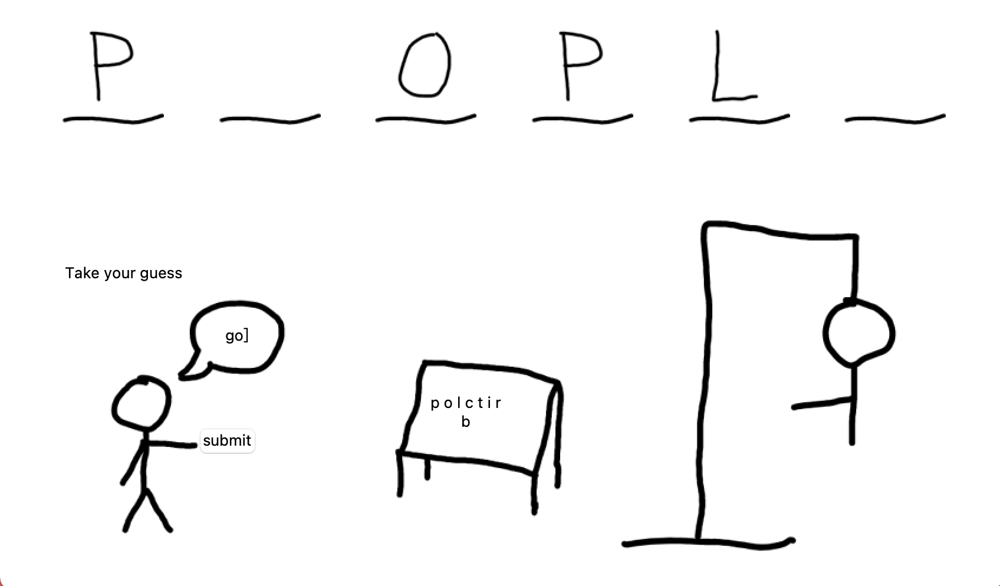
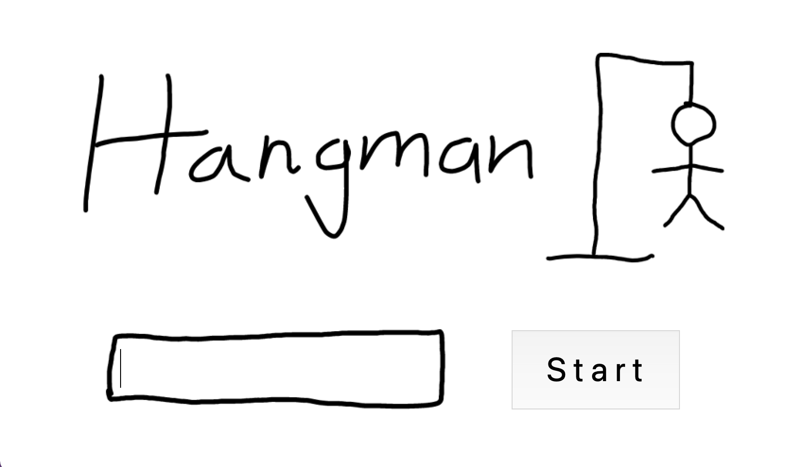

# Hangman App
A simple hangman game written in python with gui Tkinter.  



## How to play hangman
Hangman is a word guessing game where one player chooses a word and the other player tries to guess the word within a certain number of guesses. You guess by entering a letter. If the letter is in the word, that letter is revealed from the blank letters. However, if you pick a letter that is not in the word, then a stickman is slowly drawn.  
With each wrong letter guess, the man is drawn more and more. When the man is finished, he is hung and the game is lost.  
If you can reveal all the letters in the word before the man is hung then you win.

## Getting Started
Git Clone this respository or download the `.exe` file [here](https://drive.google.com/drive/folders/1og8h2OqalAaY8unH8pyZgR9kSzr1HHsd?usp=sharing).

### Prerequisites
* [PIL](https://pillow.readthedocs.io/en/stable/)
```
$ pip install pillow
```

## How to use
Make sure all the required files are in the same dirctory.
```
$ ls  
1-1000.txt	README.md	assets	hangman.py	start_gui.py
```

Run `python start_gui.py` or click on the `.exe` file.  



##### This app can be single player or second player  
Single player: Click on the start button with no input. The bot will randomly choose a word from `1-1000.txt` file.

Second player: Enter a word in the input form as the answer. The word must be within the minimum length of 4 or the maximum length of 15 with no special charcters or spaces. Click the start button to enter the game with your chosen word.

To guess the word, enter a letter in the speach bubble and click submit.

When the game is finished click on the reset button for a new game.

<!-- CONTRIBUTING -->
## Contributing
Contributions are what make the open source community such an amazing place to be learn, inspire, and create. Any contributions you make are **greatly appreciated**.  

1. Fork the Project
2. Create your Feature Branch (`git checkout -b feature/AmazingFeature`)
3. Commit your Changes (`git commit -m 'Add some AmazingFeature'`)
4. Push to the Branch (`git push origin feature/AmazingFeature`)
5. Open a Pull Request

<!-- CONTACT -->
## Contact
Email - josephhuang08@gmail.com